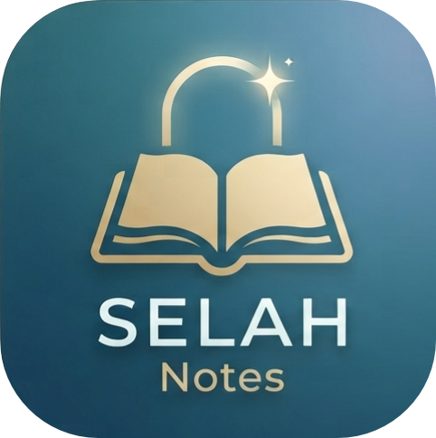
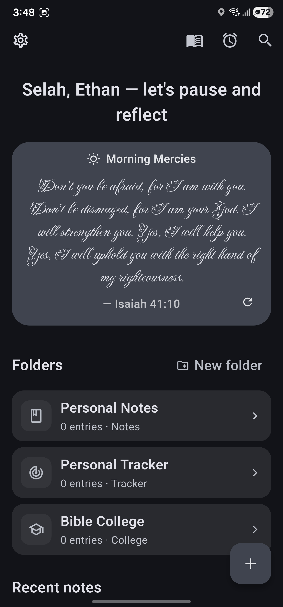
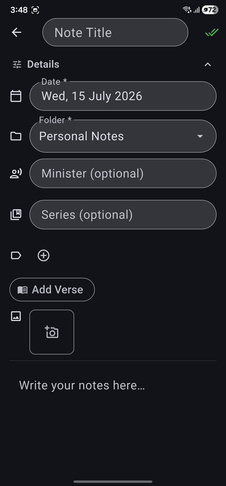
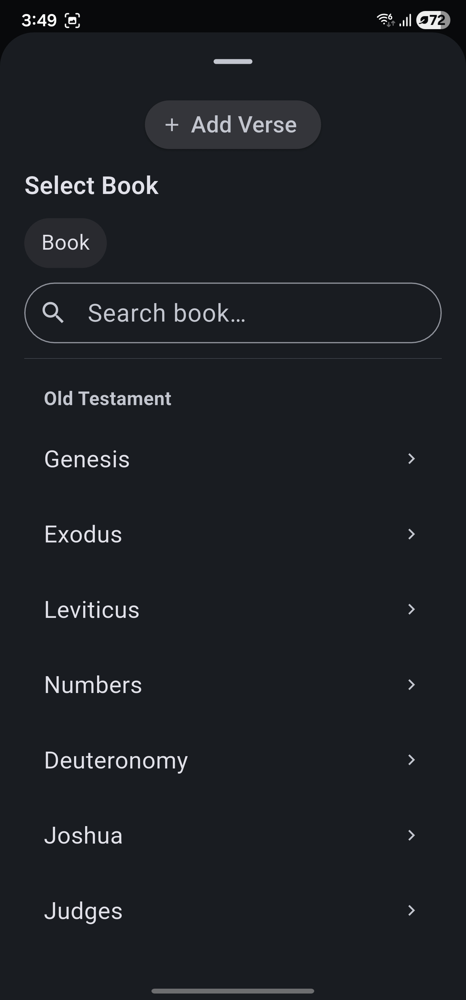
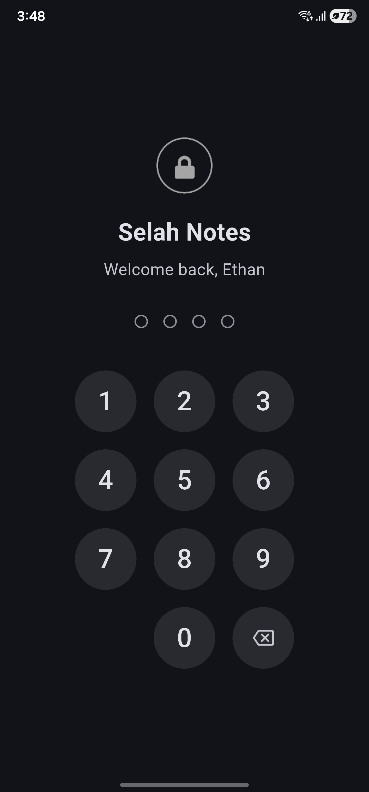

<div align="center">



# Selah Notes

**Capture sermon notes and personal spiritual trackers — with the MKJV Bible built right in.**

[](https://github.com/3th4n-J/selah-notes-app/releases)
[](https://github.com/3th4n-J/selah-notes-app/releases)
[](https://flet.dev)
[](https://www.python.org)
[](#-privacy)

<em>“Be still, and know that I am God.” — Psalm 46:10</em>

</div>

---

## ✨ Overview

**Selah Notes** is a calm, offline-first note-taking app for the everyday church-goer and Bible-college student. Jot sermon notes, keep personal spiritual trackers (prayers, dreams, visions), and study lecture notes — all with the **MKJV Bible** a tap away for pulling verses straight into your notes.

No accounts. No servers. No tracking. Your notes live on your device.

> 🕊️ Built with the prayer that it's a blessing — a quiet place to hear, reflect, and remember.

---

## 📸 Screenshots

> _Drop screenshots into `docs/screenshots/` and they'll render below._

<div align="center">

| Home | Note editor | Verse index | Lock screen |
|:---:|:---:|:---:|:---:|
|  |  |  |  |

</div>

---

## 🚀 Features

### 📝 Notes, your way
- **Three note types** — Sermon **Notes**, personal **Trackers** (Prayer, Dream, Vision, Testimony…), and **Bible College** lecture notes.
- **Templates at creation** — start from a Sermon outline or Lecture skeleton, or a blank page.
- **Context fields** — Minister (sermon notes) with autocomplete, Course + Lesson (college notes).
- **Folders** you can create, rename, recolour and re-icon; **pin** notes to the top.

### 📖 Scripture, woven in
- **MKJV Bible** bundled offline (66 books).
- **Verse picker** — search a book, pick chapter & verse (or a range like `JHN 3:16-18`), preview, and drop it in as a chip.
- **Reference-aware search** — `PSA23:1`, `psa 23.1-3`, `1 cor 13`, `psalms` all just work.
- **Verse of the day** on the home screen.
- **Verse cross-references** — tap a verse chip to see every other note that cites it, plus a dedicated **Verse Index** of your most-referenced scriptures.

### 🏷️ Organise & find
- **Series** field for sermon series, and **colour + icon Tags** you can create and manage.
- **Full-text search** across notes *and* the entire MKJV.
- **Multi-select** to bulk move / pin / trash. **Trash** keeps deletions for 30 days with one-tap undo.

### 📎 Rich content
- **Photo attachments** — snap a slide or handout; auto-downscaled to keep things lean (5 MB / file, 25 MB / note caps).
- **Reminders** — recurring, with due banners (and OS notifications where supported).

### 🔒 Private & secure
- **PIN app-lock** with a keypad, filling dots, and a custom unlock animation. PINs are PBKDF2-hashed, never stored in plaintext. Auto-locks after time in the background.
- **Local-first** — everything stays on-device.

### 💾 Portable
- **Backup & restore** to a JSON file (includes photos and tag styling).
- **`.snn` note files** — share a single note (all metadata + photos) and import it on another device with full fidelity.

### 🎨 Polished
- Light / Dark / System themes, **accent palettes** (+ custom colour), app & scripture fonts.
- Collapsible detail panes, smooth route transitions, tasteful animations, a personal birthday greeting, and an in-app **update checker**.

---

## 🛠️ Tech stack

| | |
|---|---|
| **Language** | Python 3.10+ |
| **UI** | [Flet](https://flet.dev) 0.85.3 (Flutter under the hood) |
| **Storage** | SQLite — `MKJV.db` (read-only scripture) + `userDB.db` (your data) |
| **Imaging** | Pillow (photo downscale/re-encode) |
| **Tooling** | [uv](https://github.com/astral-sh/uv) for env & builds |
| **Extensions** | `flet-local-notifications` (vendored) for OS reminders |

---

## 🏁 Getting started (development)

```bash
# 1. Install uv (https://github.com/astral-sh/uv), then sync deps
uv sync

# 2. Run on desktop for quick iteration
uv run flet run

# 3. Build a signed Android APK (see Release workflow below)
uv run flet build apk
```

> **Note:** Android release builds use a **vendored build template** (`flet-build-template/`) that carries a core-library-desugaring patch — keep it committed.

---

## 📦 Release workflow

Two helper scripts (git-ignored, since they hold local paths/secrets) make releases a two-step affair:

```powershell
# Build a signed APK — prompts for the keystore password, auto-increments versionCode
.\build-release.ps1

# Commit, tag (vX.Y.Z), push, and publish the GitHub release
.\create-release.ps1            # prompts once for a message used as commit + release notes
.\create-release.ps1 -Build     # chain both: build then release
```

Signing uses **Play App Signing-ready** release keys (your `.jks` is the upload key). Releases are published to the public downloads repo.

📥 **Download the latest APK:** [github.com/3th4n-J/selah-notes-app/releases](https://github.com/3th4n-J/selah-notes-app/releases)

---

## 🗂️ Project structure

```
src/
├─ main.py                # entry point: theming, routing, app-lock gate, lifecycle
├─ assets/                # MKJV.db, fonts, icon, splash, unlock animation
└─ app/
   ├─ config.py           # constants, palettes, templates, version
   ├─ db.py               # SQLite data layer (notes, tags, photos, backup, .snn)
   ├─ prefs.py            # JSON preferences + transient nav state
   ├─ security.py         # PIN hashing (PBKDF2)
   ├─ media.py            # photo downscale/re-encode
   ├─ theme.py            # Material 3 theming + accent handling
   ├─ ui.py               # shared components (cards, chips, dialogs, pickers)
   ├─ updates.py          # in-app GitHub release check
   ├─ verse_picker.py     # MKJV verse picker
   └─ views/              # home, editor, folder, search, settings, reminders,
                          # trash, verses, lock
extensions/               # vendored flet-local-notifications
flet-build-template/      # vendored build template (desugaring patch)
```

---

## 🔐 Privacy

Selah Notes is **offline-first and account-free**. Your notes, photos and reminders never leave your device. The only network request is an optional check to GitHub for app updates. Backups and shared `.snn` files are created **only when you choose to export them**.

---

## 🙏 Acknowledgements & Author

Made with care by **Ethan Johnston**.

Scripture text: **Modern King James Version (MKJV)**.

> May this app be as much of a blessing to you as it was building it.
> Jesus loves you and wants a deeper relationship with you.
> Be blessed.❤️

---

<div align="center">
<sub>© 2025–2026 Ethan Johnston · Selah Notes</sub>
</div>
